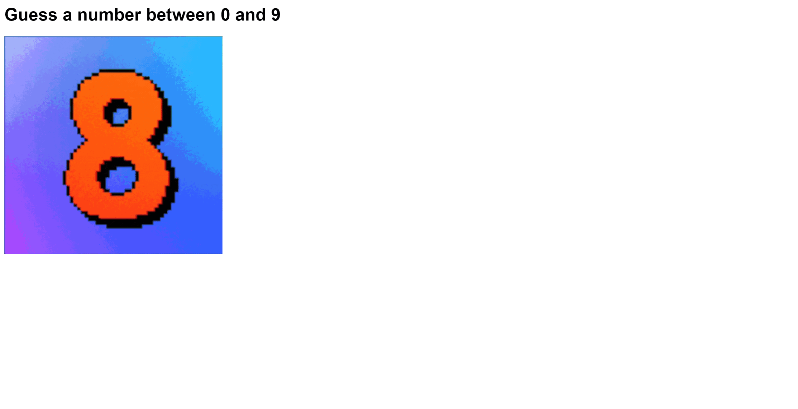

# Number Guessing Game

A web number guessing game built with Flask.



## How to play

First clone the repository and install the required modules. Then run the following command:

```
python main.py
```

Then open your browser on http://127.0.0.1:5000/. You can start to guess the number by type them in the end of the url like http://127.0.0.1:5000/5.

The website will navigate you to a new place and you will know if it is too high or too low. Enjoy playing!

## Show your support

Give a ⭐️ if you like this project!

## License

[MIT](LICENSE)